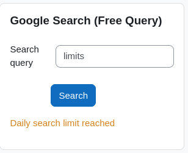

# Search Blocks For Moodle

This repository contains two block plugins for Moodle that allow students to search Google from a Moodle page.

The **search_google_fixed** can be added by teachers to a course page and displays the search results for a query that is set by the teacher.

The **search_google_free** can additionally be added to the Dashboard of any user. It allows the user to type in the search query.

The plugins require a Google API Key that can be used with the Custom Search Engine API as well as a Programmable Search Engine ID. These must be set in the global configuration of the plugins.

Since making calls to this API may be a bit expensive, both plugins provide mechanisms to limit API usage:
- **search_google_fixed** allows **caching** the search results for a chosen amount of time. Since the search query in an instance of the block doesn't change with time and is the same for all students visiting the course page, this reduces the number of API calls significantly.
- **search_google_free** doesn't do caching but allows setting a **daily search limit per user**.

Global settings:

Both plugins can be configured to show the search results as JSON text.

Block configuration for search_google_fixed:

**search_google_fixed** additionally shows if the results are new or come from the cache:

New search | Cached Search | JSON display
:-: | :-: | :-:
  |   | 

**search_google_free** additionally shows the number of remaining searches of a user, if the feature is enabled:

Search with daily limit | Search without daily limit | JSON display
:-: | :-: | :-:
  |   | 

Both plugins display appropriate error messages:

Missing configuration | Limit reached
:-: | :-:
  |  
